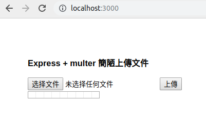
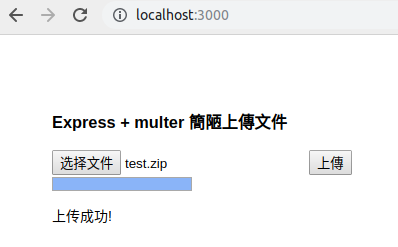
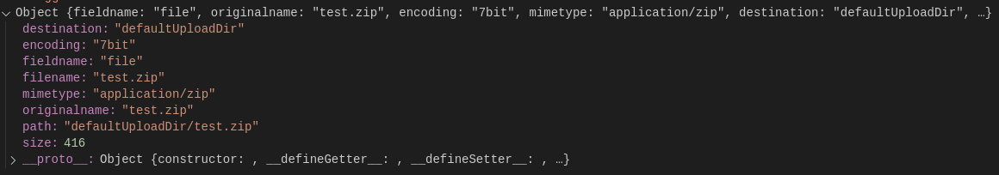
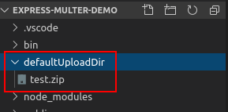
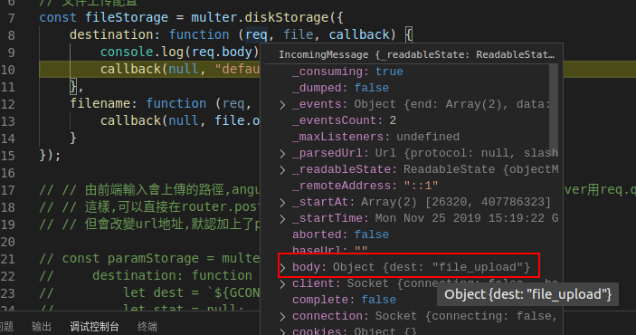
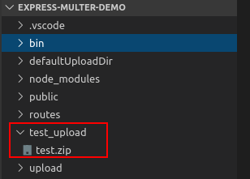

Express+multer 文件上传,并在 router 中指定文件存放路径

# 内容简单说明

&emsp;&emsp;文件上传是 web 开发中比较常见的一个功能虽然说起来是文件上传，实际上，可以看做是对 multipart/form-data 数据的处理。在 npm 中,有很多处理类似数据的库，包括周下载量近 2kw 的 form-data，周下载量近 3mw 的 formidable。

&emsp;&emsp;不过，如果 nodejs 后端使用的 express 框架，其官方也有一个自己的文件上传中间件，用它自己的话来说就是：“Multer 是一个 node.js 中间件，用于处理 multipart/form-data 类型的表单数据，它主要用于上传文件。”

&emsp;&emsp;使用 multer 比较简单，一般就是  
&emsp;&emsp;&emsp;&emsp;1、导入 multer，  
&emsp;&emsp;&emsp;&emsp;2、指定文件上传地址（如果有必要的话，不指定只是写到内存中），  
&emsp;&emsp;&emsp;&emsp;3、在 router 的路径后，回调函数前，写一个`upload.single(photo)`（单文件）或者`upload.array('photos', 12)`（多文件），在 router 的回调中，就可以使用`req.file 或者 req.files`获取文件了。

&emsp;&emsp;在这里，因为指定的上传地址是在 multer(opts)中的 opts 配置，所以 opts 配置号一个地址之后，后续修改就不是那么方便。如果需要对不同文件不同路由路径指定不同的文件上传地址，那应该如何处理？

&emsp;&emsp;multer 的简单使用后文会给个示例，但是最终的目的，**是想要在 express 的 router 回调函数中，可以指定文件上传的路径，而不是所有的文件都上传到唯一指定的路径。**例如，路由是“testUpload”，我在 router 处理时指定存放到测试使用的上传路径。路由是“formalUpload”，我在处理时可以指定存放到正式的上传路径。

# express+multer 基本文件上传示例

&emsp;&emsp;因为主要是测试 multer 内容，所以一切从简，就在一个简单的 express 项目中测试就好

## 1、创建一个 express 项目（前提：已安装 express-generator），并安装 multer

```
express --view=ejs express-mutler-demo
// 进入项目根目录
npm i multer
```

## 2、上传页面编写

&emsp;&emsp;修改 views/index.ejs 的<body>标签内容如下：

```
  <div>
    <h3>Express + multer 簡陋上傳文件</h3>
    <form method="post" action="/upload" id="upload-form" encType="multipart/form-data">
      <input id='upload' type="file" name="file" />
      <input type="submit" value="上傳">
    </form>

    <!-- 进度条 -->
    <progress id="uploadprogress" min="0" max="100" value="0">0</progress>
    <p id='msg'></p>
  </div>

  <!-- 引入jquery.js -->
  <script src="https://code.jquery.com/jquery-3.4.1.min.js"
    integrity="sha256-CSXorXvZcTkaix6Yvo6HppcZGetbYMGWSFlBw8HfCJo=" crossorigin="anonymous"></script>

  <script>
    let form = $("#upload-form");
    form.on('submit', function (event) {

      // 清除提交结果显示信息
      $("#msg").html("");

      // 在原页面处理，不跳转
      event.preventDefault();

      // 检查是否支持FormData
      if (window.FormData) {
        let formData = new FormData();

        // 建立一个file表单项，值为上传的文件
        formData.append('file', $('#upload').get(0).files[0]);
        let xhr = new XMLHttpRequest();
        xhr.open('POST', $(this).attr('action'));

        // 进度条占比计算
        xhr.upload.onprogress = function (event) {
          if (event.lengthComputable) {
            let complete = (event.loaded / event.total * 100 | 0);
            $("#uploadprogress").val(complete);
            $("#uploadprogress").innerHTML = complete;
          }
        };
        // 定义上传完成后的回调函数
        xhr.onload = function (e) {
          if (xhr.status === 200) {
            $("#msg").html("上传成功!");
            // alert('上传成功！');
          } else {
            // alert('文件上传出错了！')
            $("#msg").html("上传失败!");
          }
        };
        // 发送表单数据
        xhr.send(formData);
      }
    });
  </script>
```

&emsp;&emsp;代码内容很简单，就是一个 form 用来模拟文件上传，为了最简单，直接使用的 XMLHttpRequest 实现上传，还没事整了个进度条。  
&emsp;&emsp;本来想用原始的方法，还是引入了 jquery。更简略类似下面也 ok。

```
<script>
    function PostData() {
        $.ajax({
            type: "POST",
            url: "XXX",
            data : "",
            success: function(msg) {
            }
        });
        return false;
    }
</script>
<form onsubmit="return PostData()">
    <input type="text" value="">
    <input type="submit">
</form>
```

&emsp;&emsp;依旧以第一个为准，页面大概是这个样子（运行 express 项目，在 localhost:3000 看到）：



## 3、multer 的简单配置

&emsp;&emsp;新建一个 util/Upload.js，编写 multer 配置并导出：

```
const multer = require('multer');

// 文件上传配置
const fileStorage = multer.diskStorage({
    destination: function (req, file, callback) {
        callback(null, "/defaultUploadDir");
    },
    filename: function (req, file, callback) {
        callback(null, file.originalname);
    }
});
// 导出配置
module.exports = {
    fileUpdate: multer({ 'storage': fileStorage }),
}
```

**注意：上传地址 "/defaultUploadDir"要先手动创建，否则报错。**

## 4、在对应 router 中使用 multer

&emsp;&emsp;在 routes/index.js 中，添加以下 router 代码：

```
router.post('/upload', upload.fileUpdate.single('file'), function (req, res, next) {

  const file = req.file;
  console.log(file);

  //如果得到了文件，就返回上传成功
  if (file) {
    return res.status(200).json({ success: true });
  } else {
    return res.status(500).json({ success: false });
  }
});
```

&emsp;&emsp;记得在最上面引入 multer 配置：

```
const upload = require('../util/Upload');
```

&emsp;&emsp;几个简单注意点：  
&emsp;&emsp;&emsp;&emsp;1、这个路由路径和路由方法，要和前台页面中的 action 和 method 一致；  
&emsp;&emsp;&emsp;&emsp;2、多文件就要 upload.array(),单文件就用 upload.single()（后续都是单文件示例中说明）;  
&emsp;&emsp;&emsp;&emsp;3、第二点()里面的标志字符串要和前台页面中的`<input id='upload' type="file" name="file" />`name 属性一致。

&emsp;&emsp;如果步骤都正确，成功上传，应该可以看到前台页面如下：  


&emsp;&emsp;router 的回调中取得上传文件的信息，如下：


&emsp;&emsp;文件上传的位置：  


# 关于使用 multer 文本域数据

&emsp;&emsp;multer 的 readme 所说：”Multer 会添加一个 body 对象 以及 file 或 files 对象 到 express 的 request 对象中。 body 对象包含表单的文本域信息，file 或 files 对象包含对象表单上传的文件信息。“  
&emsp;&emsp;实际测试，在前台页面 index.ejs 创建 formData 后，append 一个文本数据：

```
let formData = new FormData();

// 补入此句
formData.append('dest', 'file_upload');

```

&emsp;&emsp;刷新页面之后，重新上传，可以在 multer 配置中，在 diskStorage 的 destination 的 callback 中，可以得到 req.body 包含了 dest 属性。如下图：  


&emsp;&emsp;这是好事，很好的，这样，在前台上传文件时，就可以把需要上传的地址放到这里，那么不同的文件上传就可以存放的不同的地址了。  
&emsp;&emsp;那么会有哪些问题呢？  
&emsp;&emsp;&emsp;&emsp;1、前端需要知道后台的上传路径，不合理。  
&emsp;&emsp;&emsp;&emsp;2、并不是所有使用 formData.append()添加的属性都能在文件上传 destination 生成前，在 req.body 中获取到。

&emsp;&emsp;&emsp;&emsp;这是一个实际遇到的问题，我在使用 angular 时，使用 HttpClient 实现文件上传操作，类似：

```
  upload(file: any) {
    // 文件使用FormData发送
    const formData: FormData = new FormData();
    formData.append('file', file, file.name);
    formData.append('file_name', file, file.name);
    return this.http.post(this.URL + '/upload', formData );
  }
```

&emsp;&emsp;后台的 req.body 在获取到上传的文件前并不会有 file_name 属性的值，即在 multer 配置在 diskStorage 的 destination 的 callback 中，可以得到 req.body 是空，在对应 upload 的 router 回调中，才取得 req.body 的 file_name 属性。

# 在 router 的回调中，指定文件上传的路径。

&emsp;&emsp;在”关于使用 multer 文本域数据“这部分有讲到，前台直接传入文件上传的路径不合理，在接受到上传的文件前得到指定的上传路径也不一定成功，而直接使用配置好的 multer，其文件上传目的地 destination 又只有固定一个。该如何实现？

&emsp;&emsp;**把 multer 的配置，封装到一个返回 promise 的函数，指定传入一个文件路径参数，并在 router 的回调中使用该函数，传入上传路径。**

&emsp;&emsp;修改 utils/Upload.js 文件，补入以下内容：

```
// multer文件上传,可指定上传路径,不在router参数里直接用
let uploadFunction = (req, res, dest) => {

    let storage = multer.diskStorage({
        destination: function (req, file, cb) {
            let newDestination = dest;
            let stat = null;
            try {
                // 检查传入的路径是否存在，不存在则创件
                stat = fs.statSync(newDestination);
            } catch (err) {
                fs.mkdirSync(newDestination);
            }
            if (stat && !stat.isDirectory()) {
                throw new Error('文件目录： "' + dest + '已存在！"');
            }
            cb(null, newDestination);
        },
        filename: function (req, file, callback) {
            callback(null, file.originalname);
        }
    });

    let upload = multer({
        storage: storage
    }).single('file');

    return new Promise((resolve, reject) => {
        upload(req, res, (err) => {
            if (err) {
                return reject(err);
            }
            resolve();
        })
    })
};
```

&emsp;&emsp;记得导出：

```
module.exports = {
    fileUpdate: multer({ 'storage': fileStorage }),
    uploadFunction,
}
```

&emsp;&emsp;在 router 中使用，修改原 routes/index.js 的 upload 路由如下：

```
router.post('/upload', /*upload.fileUpdate.single('file'), */ async function (req, res, next) {

  // 指定文件上传路径
  let uploadPath = 'test_upload';
  // 等到文件上传完成
  await upload.uploadFunction(req, res, uploadPath);

  const file = req.file;
  console.log(req.file);
  //如果得到了文件，就返回上传成功
  if (file) {
    return res.status(200).json({ success: true });
  } else {
    return res.status(500).json({ success: false });
  }
});
```

&emsp;&emsp;当然，await 需要在 async 函数中使用，也最好放到 trycatch 中。

&emsp;&emsp;如果步骤正确，结果应该和第一步中的一样，文件上传成功。在后台的项目中会新建一个 test_upload 文件夹，并有上传的文件。  


&emsp;&emsp;以上内容，全部亲测有效，如果有问题，请提出交流，谢谢。
